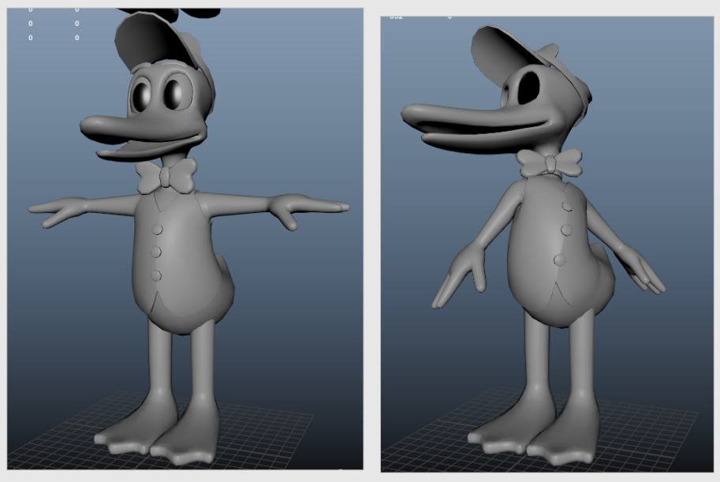

# Journal four

*Mar 05 2026 to Mar 26 2026*

## What I've done

- Modeled eyebrows with a bit of depth, rather than just being a flat plane
- Fixed the eye lattice (again)
- All clothing is now skinned properly
- Created a blink blendshape
    - Blendshapes are on a seperate proxy mesh, being copied to the main duck

## Clothing

The vest pretty easy, I was able to copy the skin layers from the body and they worked right away. Same with the band part of the bowtie, it stretches with the neck just fine with copied weights.

I used rivets for the buttons and the bow, so they follow along with everything without needing joints.

{ width=60% }

You can see the new brows there as well.

## Whats next?

- Set up eyebrow joints
- Expression controls