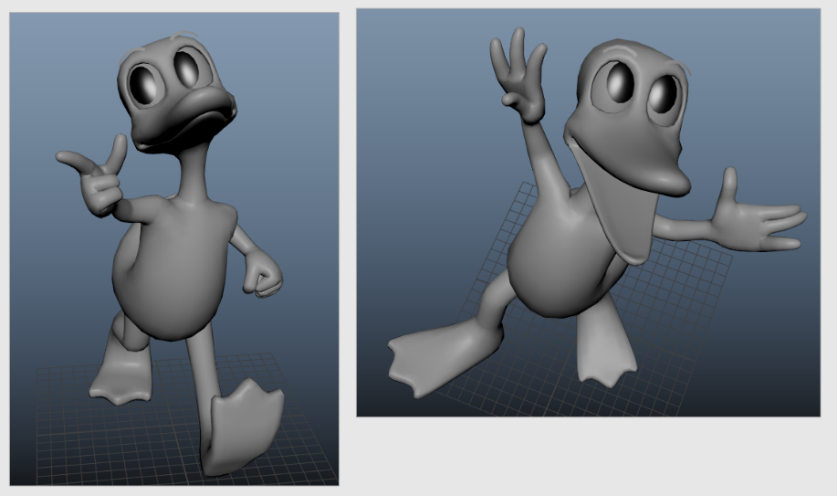
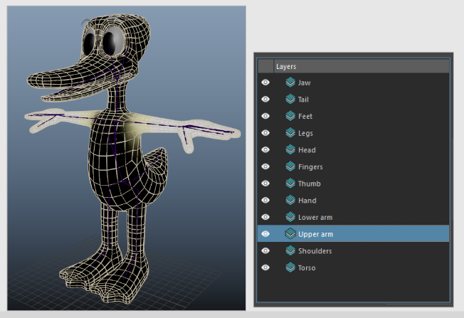

# Journal three

*Feb 12 2026 to March 05 2026*

{ width=60% }

What I've done:

- A lot of looking into more advanced mGear topics (custom scripts, data-centric rigging, etc.)
    - I've decided to limit the complexity and not hold myself to a standard of having *everything* seperate and building it at the end (though I would like to learn that).
- Adjusted all of my control sizes
- Fixed my model by adding a few more loops around the finger joints
    - Using ngSkinTools I was able to export my layers, then import them back in on the edited mesh, and everything worked mostly perfectly :D
- Learned about deformation order to make my lattice eyes work

## Skinning

Initially I followed [this mGear video guide](https://youtu.be/rBL5Ou9MRcI?list=PL9LaIDCCDjfimQVcMdh0rG0MPabPG9FK-)  to get my weights in but I found it got a bit hard to refine, and I was curious to learn more about ngSkinTools.

Using the concepts from [this video](https://youtu.be/xAi6cSyAV9M) I set up the skinning again using layers, and I found the process a lot more enjoyable!

{ width=60% }

## What's next?

- Blendshapes
- Add weights to clothes, experiement with how to rig the pieces
- Eyebrow joints
- Expression controls