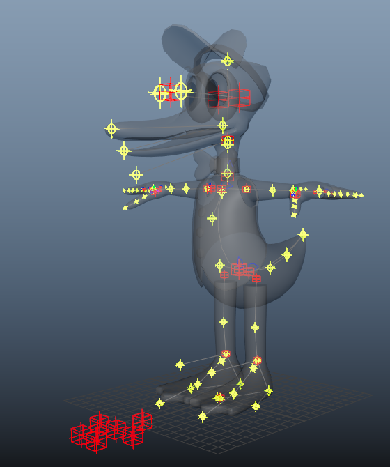
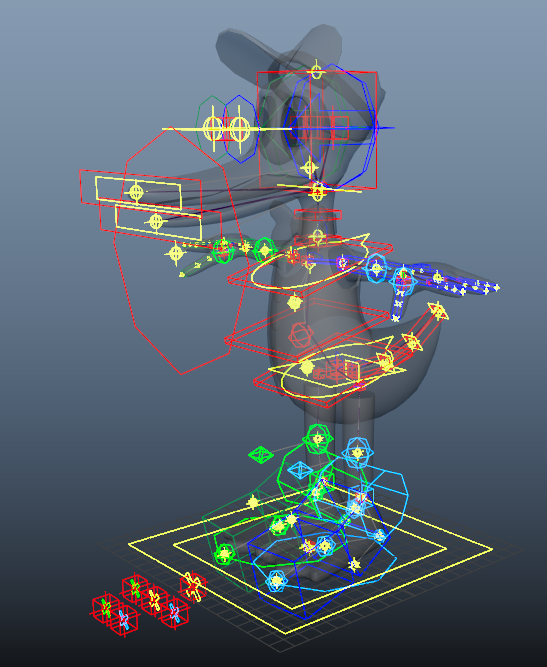
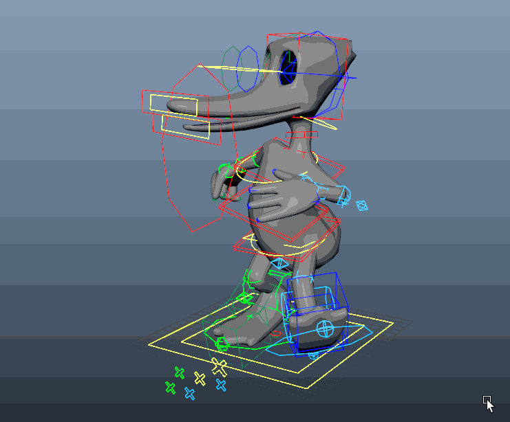

# Journal two

*Jan 26 2026 to Feb 12 2026*

## Game jam

From Jan 29 to Feb 08, a lot of my focus was turned towards the Bigmode game jam that I entered with a team. We made a [small game](https://charcle.itch.io/guppys-cleanup) (that you can play in the browser). I did the art/animations.

## mGear basics playlist

I finished taking notes on [this playlist](https://youtube.com/playlist?list=PL9LaIDCCDjfij3RTU4wacKvqmKMuSFTK2&si=ZyV6frMoo8Yu7i4j) from the mGear channel. It covered a beginner's guide to using guides and building your rig with their Shifter modular rigging tool.

There's a [basics 2 playlist](https://youtube.com/playlist?list=PL9LaIDCCDjfigP84eeMQ1PWSYtGsHgV2G&si=Ls-TX4Z4MZ3igYBG) that I'll likely check out.

## Placing mGear guides

Placed all guides for the mGear biped template, and it builds successfully when I click the button :D

{ width=60% }

{ width=60% }

## Test skin

Used a simple heat map to make sure the bones were all placed correctly.

{ width=60% }

I also fixed the lattice eyes so they have their pivot in the correct spot.
